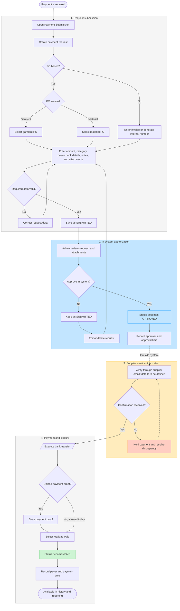

# Arkline Payment SOP — System-first draft

Status: Draft v1, based on the current `warehouse-ms` implementation.

Scope: Arkline Payment Submission in `/dashboard/arkline/financial-management`. The supplier-email authorization is intentionally shown only as a placeholder until its detailed manual SOP is defined.

## Process flow

## Current system behavior reflected above

- A request may be PO-based or non-PO-based. PO-based requests link to a garment or material PO.
- Required system fields are invoice number, category, a positive amount, account name, bank name, and account number. Non-PO requests can use an auto-generated internal invoice number.
- A newly saved request receives `SUBMITTED` status.
- On the Arkline page, an Admin can approve a submitted request. The system records `approved_by` and `approved_at`, then changes the status to `APPROVED`.
- An Admin can mark an approved request as paid. The system records `paid_by` and `paid_at`, then changes the status to `PAID`.
- The system stores submission attachments and payment-proof attachments in private storage.
- The application records payment activity; it does not execute a bank transfer.

## Important current-state gaps for the next revision

1. Supplier-email authorization is not represented in the application yet. Its position in this draft is after system approval and before the transfer.
2. The database recognizes `NEED_REVISION`, but the current screen has no operational return/reject action. An unapproved request simply remains `SUBMITTED` and can be edited or deleted.
3. Payment proof is optional: the system can mark an approved request as `PAID` without proof, including through the bulk action.
4. The same Admin role can approve and mark a payment as paid, so separation of duties is not enforced.
5. Interface permissions restrict actions, but the current database row-level policies allow any authenticated account to select, insert, update, or delete payment records and attachments. This must be tightened before treating the screen as a strong authorization control.

## Proposed next workshop inputs

- Who sends the supplier-verification email and who must reply.
- Which email address/domain is authoritative for each supplier.
- Required confirmation content: invoice, PO, amount, beneficiary name, bank, and account number.
- What evidence must be attached to the payment request.
- Expiry, reminder, discrepancy, rejection, and escalation rules.
- Whether the system approver and payment executor must be different people.
